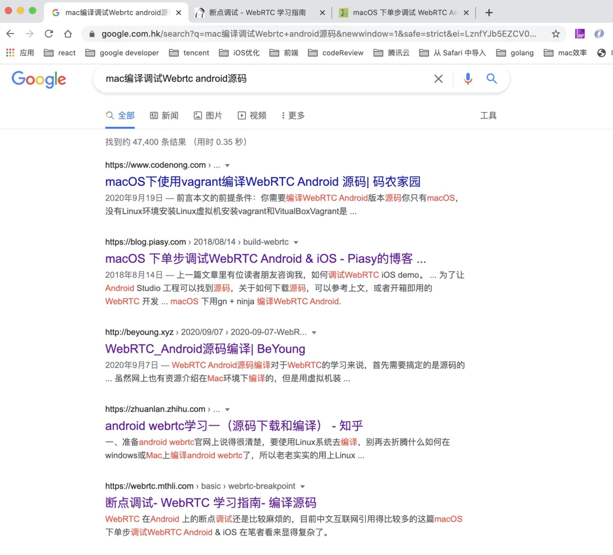
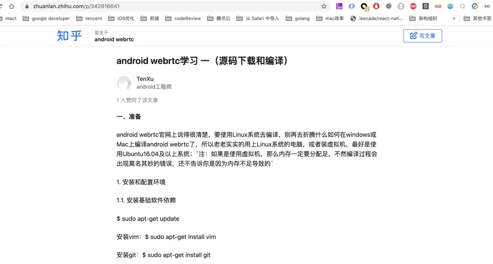
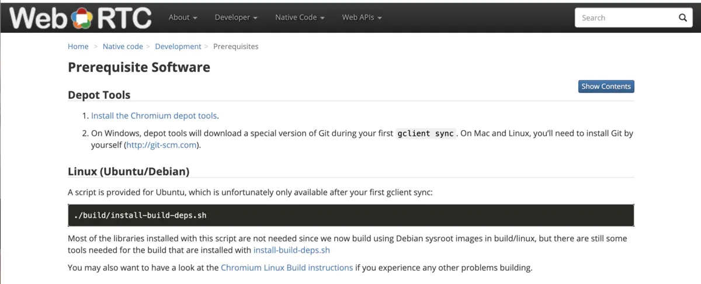
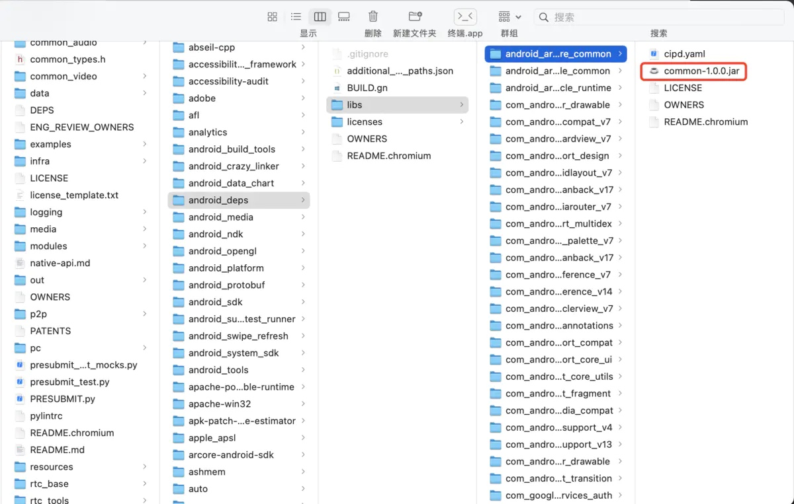
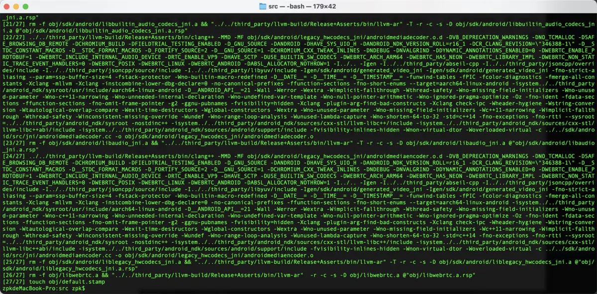
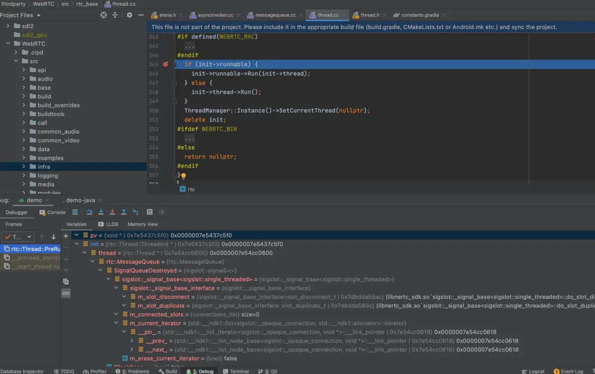

痛点
如果你借助google引擎检索标题 你会得到以下结果





看来WebRTC 在 Android 上的断点调试不是一般麻烦的，在中文互联网引用得比较多的这篇[ macOS 下单步调试 WebRTC Android & iOS](https://blog.piasy.com/2018/08/14/build-webrtc/index.html) 这位大神手撸CMakeLists.txt方式对基于gn,ninja开发的工程不甚友好，而且后面更新WebRTC引擎版本又的来一遍。大部分人会参考 [WebRTC Android 的调试](http://blog.pprtc.com/2020/10/14/WebRTC-Android-debug/)  或者[ 断点调试- WebRTC 学习指南- 编译源码](https://webrtc.mthli.com/basic/webrtc-breakpoint/)，顺着教程做下去往往是时间和精力白白浪费了，因为大家的本地电脑环境和Webrtc版本要求编译环境不一致，会有千奇百怪的错误。

回归正题，笔者完全赞同Piasy说的 macOS下用 gn + ninja 编译WebRTC Android 才能完美解决 官方的这个 [issue](https://bugs.chromium.org/p/webrtc/issues/detail?id=9282) 。

正餐
macOS下用 gn + ninja 编译WebRTC Android
回想下我们在mac上编译WebRTC iOS/mac 或者linux 下编译WebRTC android 何其顺利。

回顾下我们在[mac上编译WebRTC iOS的流程](https://webrtc.github.io/webrtc-org/native-code/ios/)

1.Development Environment

NOTICE: You will need to [install Chromium depot_tools](https://webrtc.github.io/webrtc-org/native-code/development/prerequisite-sw/).

2.Getting the Code

fetch--nohooks webrtc_ios

gclient sync

3.Generating project files

# debug build for 64-bit iOS

gn gen out/ios_64--args='target_os="ios" target_cpu="arm64"'

# debug build for simulator

gn gen out/ios_sim--args='target_os="ios" target_cpu="x64"'

4.Compiling with ninja

ninja -C out/ios_64 AppRTCMobile

在比较下在[linux上编译WebRTC android的流程](https://webrtc.github.io/webrtc-org/native-code/android/) 主要差异在

Getting the Code

Android development is only supported on Linux. 好家伙人家直接就说Android 开发仅在 Linux 上支持！！！(把不能变成能--才能体验我们程序猿的价值嘛)

[Install prerequisite software
](https://webrtc.github.io/webrtc-org/native-code/development/prerequisite-sw/)

Create a working directory, enter it, and run:

```

fetch--nohooks webrtc_android

gclient sync

```

点击必备软件链接去看




mac上编译iOS 跟 linux上编译android 步骤上就相差执行./build/install-build-deps.sh 命令，成功执行该命令后 build目录下多了很多android相关目录。

嗯。我们现在就mac上照着官网linux编译android步骤做

#1. [Install the Chromium depot tools](http://dev.chromium.org/developers/how-tos/install-depot-tools).

#2. Getting the Code

Create a working directory, enter it, and run:

fetch--nohooks webrtc_android

gclient sync

#3. 执行脚本 ./build/install-build-deps.sh

当你在mac 终端执行命令的时候

$ ./build/install-build-deps.sh

ERROR: lsb_release not found in $PATH

try: sudo apt-get install lsb-release

果然我们遇到第一个错误。如果你尝试浏览器寻找 'mac 上安装lsb_release 命令'的解决方法，你最后会卡死在这，反正我在mac上找不到安装lsb_release命令的方法，不管是brew install 还是 pip install。其实问题的解决很简单，我们只要linux下执行该命令把下载的文件拷贝过来就行。你可以通过mac与linux虚拟机共享webrtc源码目录，也就省去拷贝的动作

#4. gn gen out/Debug--args='target_os="android" target_cpu="arm"'

执行这个命令 你基本不会遇到什么报错( 有报错的话，基本就是你源码没有下载完全或者[Chromium depot tools](http://dev.chromium.org/developers/how-tos/install-depot-tools) 与 webrtc 源码版本不匹配)

#5.到了最后激动人心一步 ninja  -C  out/Debug -v (添加-v 你才能在终端上看到编译错误详情)

在执行ninja -C out/Debug -v命令之前，要确保使用正确的编译链， 目录在src/third_party/llvm-build 这里要切换回mac编译WebRTC iOS/mac的编译链。因为之前你用虚拟机下载过linux下的android依赖文件。建议你编译链目录这样分5个目录 llvm-build llvm-build-apple  llvm-build-wins  llvm-build-android-linux llvm-build-android-mac。在每次编译对应平台版本的Webrtc库前，执行脚本将对应平台编译链目录拷贝覆盖到llvm-build这个目录。llvm-build是webrtc工程下gn默认指定的编译链搜索目录

之后你可能遇到以下的问题

1. 缺失 Xcode  Command Line Tools。

    解决方案： 安装xcode

2. $JAVA_HOME 未配置

    解决方案： ~/.bash_profile 下 export  JAVA_HOME=你的安装目录

3. java 编译警告as Error

    解决方案：  javac版本不对，更新javac时同时更新下JAVA_HOME对应地址

    根据当前webrtc版本查找对应的javac版本

4. python 执行报错问题 

    解决方案： 

    1 如果 python2 或者 python3 版本的报错

    在~/.bash_profile下 alias python=python2 或者 alias python=python3

    2.一般你求助搜索引擎，可以得到解决方案

5. 缺失相关java架包/aar 目录在src/third_party/android_deps/libs下各个子目录

    解决方案： 这个没啥好说的缺啥补啥，你大概要去外网下载20-30来个文件



一套操作下大概你需要耗时20-30分钟左右，完全取决于你科学上网的速度。最后你会见证这份喜悦

截图如下 mac上成功编译出 android版的libwebrtc.a。因为之前已经成功编译过，做了小量缓存删除，只有27步编译步骤




